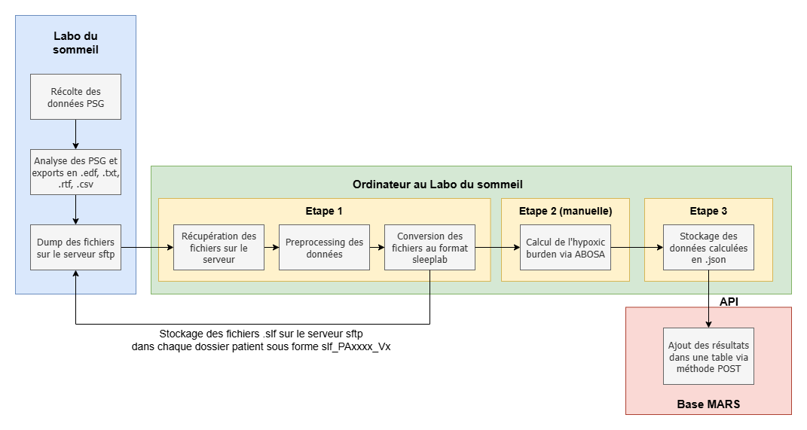

# Indicator-pipeline documentation (english version)

# 📑 Table of contents

1. 🧭 [Overview](#-overview)
    1. 🌀 [Execution Flow Description](#-execution-flow-description)
2. 🔧 [Technical Stack](#-technical-stack)
3. 🗂️ [Projet structure](#-projet-structure)
4. ⚙️ [Installation and Configuration](#-installation-and-configuration)
    1. 🖥️ [Local Installation](#-local-installation)
    2. 🐳 [Building the Docker Image](#-building-the-docker-image)
    3. ⚙️ [Environment Configuration](#-environment-configuration)
5. 🚀 [Pipeline Execution](#-pipeline-execution)
    1. 🐍 [Option 1 – Orchestrated Execution via Snakemake (Recommended)](#-option-1--orchestrated-execution-via-snakemake-recommended)
    2. 🧪 [Option 2 – Manual Execution (Main Script)](#-option-2--manual-execution-main-script)
6. 🦌 [Calculating Indicators with ABOSA](#-calculating-indicators-with-abosa)
    1. 📝 [Calculation Parameters](#-calculation-parameters)
    2. 🩸 [Saturation Signal](#-saturation-signal)
    3. 💾 [Output files](#-output-files)
7. 🐍 [Pipeline Code Overview](#-pipeline-code-overview)
    1. 🔌 [SFTP Server Connection](#-sftp-server-connection)
    2. 🔄 [PSG to .slf Conversion](#-psg-to-slf-conversion)
    3. 🔄 [Excel to JSON Conversion](#-excel-to-json-conversion)
    4. 🧰 [Utilities](#-utilities)
    5. 📋 [Logging](#-logging)
8. 📚 [Resources and appendices](#-resources-and-appendices)

# 🧭 Overview

- The purpose of this pipeline is to compute indicators from the SpO2 signal of polysomnography files (*.edf* and annotations in *.csv*, *.txt*, and/or *.rtf*) available on the storage server. Polysomnography files are first converted to the *sleeplab* format (*slf*) and stored both on the storage server and locally. The software then calculates the indicators manually via ABOSA, and finally the data output from the software is integrated into the MARS database.
- This pipeline was designed for use on a Windows dedicated machine or a Windows VM.
- Input data consist of polysomnography files available on the storage server. The output consists of the calculated indicators stored in the MARS tables dedicated to oximetry measurements.

## 🌀 Execution Flow Description

- **SFTP server connection**: retrieval of *.edf* files and annotation files (.*csv*, .*txt*, .*rtf*) for specified years.
- **Sleeplab conversion**: conversion of polysomnography files to the *sleeplab* format (via the `sleeplab_converter` module). The converted files are saved:
    - on the **storage server**, in the corresponding patient folder, under the name `slf_PAxxxx_Vx`;
    - **locally**, in the `slf-output` folder, located one level above the project root.
- **Manual ABOSA execution** *(outside the pipeline)*: the converted files must be opened and analyzed **manually** in the ABOSA software to calculate oximetry indicators. The software generates several output folders, each containing one or more Excel files. These files contain the extracted indicators as well as metadata about the analyzed recordings.
- **Import into MARS**: the results generated by ABOSA are in Excel format. The retained indicators are in the *ParameterValues* file. They are integrated into the appropriate tables of the MARS database using a POST method that sends these data to an API as *JSON* payloads.
- **Deletion of locally stored slf files**: slf files generated during conversion and stored locally are automatically deleted from the local directory once all indicators have been calculated, in order to avoid the accumulation of unnecessary data.



*Pipeline diagram*

---

# 🔧 Technical Stack

- **Main language**: Python 3.10.10
- **Project structure**: Modular organization under `src/` with two packages:
    - `indicator_pipeline`: handles connections, conversions, and DB interactions
    - `sleeplab_converter`: converts PSG data to the *sleeplab* format
- **Pipeline orchestration**: `Snakemake` (defined in the `Snakefile`)
- **Reproducible environment** via `Docker` (defined in the `Dockerfile`) to ensure consistent execution
- **Project management & dependencies**: `pyproject.toml`
- **Logging**: Custom configuration using `logging_config.py`
- **SFTP connection**: Custom SFTP client (`sftp_client.py`)
- **Database**: Integration into the MARS database (MySQL)
- **Supported formats**:
    - **EDF** files (biosignals)
    - **Annotation** files (*.csv*, *.txt*, *.rtf*)
    - **Excel** files
- **External libraries**:
    - EDF file handling: `pyedflib`, `mne`
    - Data processing: `pandas`, `numpy`, `tqdm`, `openpyxl`
    - Connections & system: `paramiko`, `python-dotenv`
    - Specific files: `striprtf`, `sleeplab-format`
- **Target environment**: Dedicated machine or Windows VM (required to run ABOSA; incompatible with Linux or macOS)

---

# 🗂️ Projet structure

```markdown
indicator-pipeline/
├── docs/
├── logs/
│		├── processed.json
│		├── slf_usage.json
│		├── pipeline_xxxx.log
│		├── warning_and_errors_xxxx.log
├── src/
│   ├── indicator_pipeline/
│   │   ├── __init__.py
│   │   ├── excel_to_json.py
│   │   ├── logging_config.py
│   │   ├── run_pipeline.py
│   │   ├── sftp_client.py
│   │   ├── slf_conversion.py
│   │   └── utils.py
│   │
│   └── sleeplab_converter/
│       ├── __init__.py
│       ├── edf.py
│       ├── events_mapping.py
│       └── mars_database/
│           ├── __init__.py
│           ├── annotation.py
│           ├── convert.py
│           ├── LICENSE.txt
│           └── README.md
├── .gitignore
├── pyproject.toml
├── Dockerfile
├── Snakefile
└── README.md
```

- `docs/` - Location of documentation files (md, images) in French and English
- `logs/` – Location of generated log files and tracking files (`processed.json`, `slf_usage.json`).
- `src/`
    - `indicator_pipeline/`
        - Contains the main pipeline scripts: main module `run_pipeline`, SFTP server connection `sftp_client`, PSG to .*slf* conversion `slf_conversion`, ABOSA Excel data dump to JSON payload `excel_to_json`, logger configuration `logging_config`, and utility functions `utils`.
    - `sleeplab_converter/`
        - Converts polysomnography files to the *sleeplab* format; code sourced from the [Git repository](https://github.com/HP2-data/sleeplab-converter-mars) `sleeplab-converter-mars`.
        - Submodule `mars_database/` containing conversion and processing modules for annotation files specific to the devices used at the Sleep Lab of CHU Grenoble.

---

# ⚙️ Installation and Configuration

## 🖥️ Local Installation

- The project is version-controlled with Git and must be cloned locally to be used:

```bash
git clone <REPO_URL>
cd indicator-pipeline
```

- Dependencies are installed via the `pyproject.toml` file, which lists all required modules. It is recommended to use a virtual environment (e.g., `venv`):

```bash
python -m venv .venv
source .venv/Scripts/activate
pip install .
```

- The `.gitignore` file excludes, among other things:
    - log files
    - files generated by `setuptools`
    - temporary or automatically generated files
    - virtual environments (`.venv/`, etc.)
    - files generated by Snakemake (`.snakemake/` folder, .*done* & *.flag* files)

## 🐳 Building the Docker Image

- The project includes a `Dockerfile` to allow **isolated and reproducible execution** without local configuration.
- Building the Docker image:

```bash
docker build -t indicator-pipeline .
```

- **On Windows**, make sure Docker Desktop is configured to allow access to the disk being used (usually `C:`).
- File paths, including `.env` files, must be accessible from within the container.

## ⚙️ Environment Configuration

- The pipeline uses a `.env` file to store **sensitive or environment-specific variables**, such as SFTP credentials or folder paths.
- Example of a `.env` file:

```bash
SFTP_HOST=my.server.com
SFTP_USER=user
SFTP_KEY_PATH=pathtosshkey
SFTP_PASSWORD=password
SFTP_PORT=sftpport
ABOSA_OUTPUT_PATH=/abosa-output
LOG_OUTPUT_PATH=/app/logs
```

- Location:
    - The `.env` file should be placed at the **project root** (same level as `pyproject.toml`).
    - It is automatically loaded using the [`python-dotenv`](https://pypi.org/project/python-dotenv/) library in the relevant modules.
    - ⚠️ **Never commit this file**: it is ignored by `.gitignore`.

---

# 🚀 Pipeline Execution

⚠️ **Important**: the pipeline runs in **three phases**, with an **intermediate manual step**.

1. **Phase 1 – Automatic**
Conversion of PSG files to the *slf* format (via script or Snakemake).
2. **Phase 2 – Manual**
Analysis of the *slf* folders using the ABOSA software (outside the pipeline).
3. **Phase 3 – Automatic**
Import of the results generated by ABOSA into the database (via script or Snakemake).

This separation is **automatically managed** during Snakemake execution, using **synchronization files** (`slf_conversion.done`, `abosa_complete.flag`, etc.).

⚙️ When running manually, it is the user’s responsibility to **execute the steps one by one** and ensure that the ABOSA analysis is completed before proceeding.

### 🐍 Option 1 – Orchestrated Execution via Snakemake (Recommended)

- The project includes a `Snakefile` defining the pipeline steps as Snakemake rules.
- **Docker volumes are dynamically generated** in the `Snakefile`, based on the user’s local environment. The following paths are used:
    - `~/Desktop/slf-output` → local *slf* output folder
    - `~/Desktop/indicator-pipeline/logs` → log files
    - `~/Desktop/abosa-output` → files generated by ABOSA and used in the second part of the pipeline
- Launching the pipeline:

```bash
snakemake --config years="2024 2025" --cores 1
```

- The argument `-config years="2024 2025"` specifies the years to process during pipeline execution. If no years are specified, the **current year is used by default**.
- This method ensures a **modular, traceable, and reproducible** execution of all steps.
- The full execution follows four rules:
    1. `run_pipeline` : converts PSG files to *slf* format
    2. `wait_for_manual_step` : manual step via ABOSA (*see Calculating Indicators with ABOSA*)
    3. `import_to_mars` : sends results to the MARS database
    4. `cleanup_slf`: deletes locally stored slf files that have already been used to calculate indicators. The rule scans all subfolders of `slf-output/slf_to_compute` (e.g., `2020`, `2021`, etc.). For each sample, it checks whether all indicators are set to _True_. If so, all corresponding files or folders (`slf_<sample>*`) are deleted. Incomplete files or samples remain intact.
- **Synchronization files** (`.done`, `.flag`):
    - `slf_conversion.done` : marks the end of the conversion step (`run_pipeline`)
    - `abosa_complete.flag` : **to be created manually** after ABOSA analysis to continue execution. A `create_flag.bat` file is available in the directory to create this file.
    - `analysis_complete.done` : marks the completion of the import into MARS (`import_to_mars`)
    - `cleanup.done`: indicates that locally stored slf files that have already been used have been deleted
    
    These files serve as **step markers**, allowing Snakemake to track the pipeline progress. They are automatically created or checked by the rules, and can be removed using the following command once the entire pipeline has run:
    

```bash
snakemake clean --cores 1
```

📝 **Notes**: 

- The default Snakefile paths point to the **user’s Desktop** (`~/Desktop`). If the project is executed from a different location, you must **adapt the paths defined in the `Snakefile` (variables `SLF_OUTPUT`, `LOGS_DIR`, etc.)** accordingly.
- The `cleanup_slf` rule works even if several years are processed in parallel, by traversing all subfolders of `slf_to_compute`.

### 🧪 Option 2 – Manual Execution (Main Script)

- Main command to run the pipeline (main script `run_pipeline.py`):

```bash
run-pipeline --step slf_conversion --years 2022 2023
run-pipeline --step import_to_mars
```

- **Arguments**:
    - `--step` : *Required*. Pipeline step to execute. Two possible values:
        - `slf_conversion` : converts polysomnography files to *slf* format.
        - `import_to_mars` : imports the data produced by ABOSA into the MARS database.
    - `--years` : *Required for the `slf_conversion` step; not required for `import_to_mars`.* Year(s) to process, each year corresponding to a folder with the same name on the SFTP storage server. Multiple years must be separated by spaces (e.g., `--years 2024 2025`).

---

# 🦌 Calculating Indicators with ABOSA

To calculate indicators from the SpO₂ signal, the ABOSA software must be used **manually**. Once the first step of the pipeline is completed, the converted *slf* folders are stored in the `slf-output` directory, with one subfolder per year.

## **📝** Calculation Parameters

Once the ABOSA graphical interface is open, set the following parameters:

- *Select input folder* button (1) ⇒ select the folder corresponding to the **year** to process: `../slf-output/year`. This folder should be located **at the same level as the Git repository** (e.g., on the Desktop), **not inside the repository**.
- *Select output folder* button (2) ⇒ select the output folder. Outputs should go to `../abosa-output/year`. This folder must also be located **at the same level as the Git repository** (e.g., on the Desktop). If the folder for the year does not yet exist, it must be created manually.
- *Input file type* option (3) ⇒ check “*SLF*”.
- *Artefact removal* option (4) ⇒ check *“Yes”*.

.png)

*ABOSA software graphical user interface*

## 🩸 Saturation Signal

Once the parameters are set, click the *“RUN”* button (5). A window will open to choose which signal to use for calculating the indicators. Select the one corresponding to oxygen saturation in the “*primary label*” list **(6)**, and add the other possible formats in the “*secondary labels*” section (7) using the *“Add”* button (8). The different formats of the saturation signal are:

- SAT
- Sp02
- SpO2
- SaO2

Finally, to start the calculation of the indicators, click the *“Confirm selection”* button (9).

.png)

*Interface allowing selection of saturation signal labels before starting calculations*

## **💾** Output Files

Once the indicators have been calculated, several output files are generated. They are organized into three folders:

- `EventData_<calculation_date_and_time>`
    
    Contains Excel files with individual desaturation and recovery events for each processed *slf* folder.
    
- `ExtraInfo_<calculation_date_and_time>`
    
    Contains text files with metadata related to the calculation for each processed *slf* file. This includes detection and cleaning parameters, sleep stage durations, technical information (e.g., label used for the SpO₂ signal), artifact detection, and reasons for analysis failure if any issue occurred.
    
- `ParametersValues_<calculation_date_and_time>`
    
    Contains a single Excel file `ParameterValues` that consolidates all the calculated parameter values from the *SLF* files (one row per PAxxxx_Vx file).
    This folder also contains a text file `FileNotes` listing all the oxygen saturation signal labels used and the first file from which the primary oxygen saturation label was obtained.
    

**Note**: The data used in the second part of the pipeline and imported into the MARS database are those found in the `ParameterValues` file.

---

# 🐍 Pipeline Code Overview

## 🔌 SFTP Server Connection

**`sftp_client.py` – Simplified SFTP client based on `paramiko`**

Utility class to establish an SFTP connection and transfer files or folders between a local system and a remote server.

- **Constructor**
    
    `SFTPClient(host: str, user: str = "", key_path: str = "", password: str = "", port: int = 22)`
    
    Initializes an SFTP client with the necessary connection information (username, password or private key, port). Sensitive information is stored in a `.env` file (see *Environment Configuration `.env`* above).
    Supports **password-based** or **SSH key-based** authentication.
    
- **Methods**
    - `connect()`
        
        Establishes a connection to the remote SFTP server using the provided credentials.
        
    - `list_files(path: str = ".") -> List[str]`
        
        Lists files and folders in the remote directory `path`. Returns a list of file and/or folder names.
        
    - `is_dir(path: str) -> bool`
        
        Checks if a remote path corresponds to a directory.
        
    - `download_folder_recursive(remote_path: str, local_path: Path)`
        
        Recursively downloads the contents of a remote folder to a local directory.
        
    - `upload_folder_recursive(local_path: Path, remote_path: str)`
        
        Recursively uploads a local folder and its contents to a remote directory.
        
    - `close()`
        
        Properly closes the SFTP connection and releases resources.
        

---

## 🔄 PSG to .slf Conversion

### Module `slf_conversion.py`

This module contains the `SLFConversion` class, which centralizes the logic for converting polysomnography recordings to the *slf* format (using the `sleeplab-converter` tool) and uploading them to a remote SFTP server.

- **Class `SLFConversion`**
    
    `SLFConversion(local_slf_output: Path, remote_year_dir: PurePosixPath, sftp_client: SFTPClient)`
    
    Initializes an object to manage the conversion and transfer cycle of *slf* files for a given year, using a local output folder and a remote path on the SFTP server.
    
    **Parameters**
    
    - `local_slf_output (Path)` : Local path to the *slf* output folder, typically `../slf-output`.
    - `year_dir (PurePosixPath)` : Remote path to the folder for a specific year on the SFTP server (e.g., `/.../C1/2025`).
    - `sftp_client (SFTPClient)` : Active SFTP client providing access to remote files.
    
    **Methods**
    - `add_slf_usage()`
    
        Updates the *slf* usage tracking file (`slf_usage.json`) with any new SLF datasets. This method scans the local `slf_to_compute/<year>` directory to detect newly converted *slf* folders.

    - `convert_folder_to_slf(local_slf_output: Path, year_dir: PurePosixPath, sftp_client: SFTPClient)`
        
        Downloads all patient folders for a given year from the SFTP server into a temporary local folder, skipping those that already have *slf* outputs. Other folders are converted to the *slf* format using the `sleeplab-converter` via the `convert_dataset` method.
        Generated *slf* folders are stored locally in the `slf-output` folder, located outside the Git repository.
        
    - `upload_slf_folders_to_server(local_slf_output: Path, remote_year_dir: PurePosixPath, sftp_client: SFTPClient)`
        
        Uploads all locally generated *slf* folders to the corresponding remote year/patient folder on the SFTP server. Checks for consistency between *slf* folder names and identifiers in the remote *.edf* files to avoid misassociation.
        

---

### Package `sleeplab_converter`

- **EDF File Handling – `edf.py`**
    
    Provides utility functions to efficiently read and extract data from EDF (European Data Format) files, commonly used for storing polysomnography recordings.
    
    Supports two reading modes:
    
    - **Direct reading via `pyedflib`**, for fine-grained access to signals and headers.
    - **Reading via `MNE` library**, more robust for some annotations but potentially slower.
- **Package `mars-database/`**
    
    Handles processing of polysomnography files generated by devices used in the Sleep Lab at CHU Grenoble.
    
    - **SLF conversion module – `convert.py`**
        
        Converts polysomnography recordings to the *slf* format using `sleeplab_format`. Also parses *.edf* files and associated annotations.
        
    - **Annotation processing – `annotation.py`**
        
        Reads, harmonizes, and converts **sleep annotation files** from multiple sleep measurement devices (*Deltamed*, *RemLogic*, *BrainRT*) to make them compatible with the **Sleeplab** converter format.
        
- **Event mapping – `events_mapping.py`**
    
    Centralizes rules to map events and sleep stages from annotation files of various polysomnography devices to structured objects in the `sleeplab_format` library.
    
    Converts heterogeneous annotations (formats .csv, .txt, .rtf, etc.) into normalized events usable by the pipeline, adapting to each device’s nomenclature (*Deltamed*, *BrainRT*, *RemLogic*).
    

---

## 🔄 Excel to JSON Conversion

- `excel_to_json.py`

This module extracts data from Excel files generated by ABOSA, stores them as *JSON* payloads, and then sends them via POST requests to an API that stores them in the MARS database.
It also keeps track of already processed files to avoid duplicates.

- `load_processed(): Set[str]`
    
    Loads the list of already processed files from `processed.json`. Returns a set of relative paths identifying folders that have already been converted.
    
- `save_processed(processed_set): None`
    
    Saves the set of files marked as processed into `processed.json`.
    
- `find_parameter_folders(abosa_output_path: Path): List[Path]`
    
    Scans the ABOSA output folder to detect all subfolders containing data (`ParameterValues_...`). Returns a list of paths to these subfolders.
    
- `get_excel_from_rel_path(folder_path: Path, rel_path: str): pd.DataFrame`
    
    Loads the Excel file contained in a given folder. Raises an error if no `.xlsx` file is found.
    
- `df_to_json_payloads(df: pd.DataFrame): List[Dict[str, Any]]`
    
    Converts each row of an Excel DataFrame into a Python dictionary matching the expected JSON schema:
    
    - Extracts patient and visit identifiers
    - Converts numeric values to *int* or *float* using the function `try_parse_number(value, as_int: bool = False): Optional[Union[int, float]]` to avoid errors
    - Structures fields into categories (`desaturation`, `recovery`, `ratios`, etc.) representing the MARS tables where the data will be sent
    
    Returns a list of dictionaries, each representing a patient record.
    
- `excel_to_json(): None`
    
    Main function of the module.
    
    Orchestrates the entire process:
    
    - Searches for files to process
    - Skips files that have already been processed
    - Converts Excel files to JSON
    - Saves the generated files in `logs/json_dumps`
    - Updates `processed.json`

---

## 🧰 Utilities

- `utils.py` – Common utility functions used across multiple modules
    - `parse_patient_and_visit(filename: str) -> Tuple[str, str]`
        
        Extracts the patient ID and visit number from a string (filename containing patterns like *PxxxxVx* or *Pxxxx_Vx*). Returns a tuple with the patient ID and visit number as strings.
        
    - `extract_subject_id_from_filename(edf_file: Path) -> str`
        
        Extracts the patient ID and visit number from an EDF file path. Returns a string in the format `"PAxxxx_Vx"` (or `"PAxxxx"` if no visit number is present).
        
    - `try_parse_number(value, as_int: bool = False) -> Optional[Union[int, float]]`
        
        Converts a string to an *int* or *float*, replacing commas with dots to handle European decimal formats. Returns the number or `None` if conversion fails.
        
    - `get_repo_root() -> Path`
        
        Returns the root path of the Git repository.
        
    - `get_local_slf_output() -> Path`
        
        Returns the full path of the local output folder used to store `.slf` files (`slf-output/`).
        
    - `lowercase_extensions(dir_path: Path)`
        
        Converts all file extensions in a given folder to lowercase.
    
      - `load_slf_usage(): Dict[str, Dict[str, bool]]`
    
          Load the tracking file `slf_usage.json` that records the processing status of *slf* datasets.
    
      - `save_slf_usage(data: Dict[str, Dict[str, bool]]): None`
    
          Saves the current state of `slf_usage.json`.

---

## **📋** Logging

- `logging_config.py` – Logging configuration utilities
    - `setup_logging(years: List[str]) -> None`
        
        Configures the logging system for the pipeline by creating:
        
        - a main log file (messages at INFO level and above)
        - a separate file for warnings and errors (level WARNING and above)
        
        Log files are saved in the `logs/` folder, and their filenames include the selected years and a timestamp to ensure uniqueness.
        

---

# 📚 Resources and appendices

- `README.md` – global documentation
- `LICENSE.txt` – [**sleeplab-converter-mars](https://github.com/HP2-data/sleeplab-converter-mars)** licence